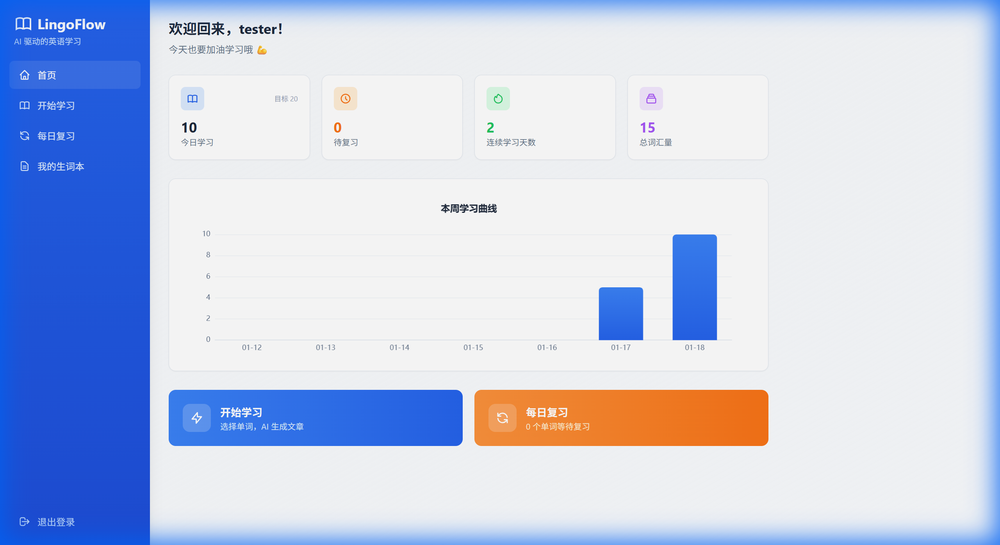

# Phase 4: 用户体验优化 ✅

## 美化效果

---

## 已完成功能

| 功能 | 状态 |
|------|------|
| 统计仪表盘（今日/待复习/连续/总量） | ✅ |
| 周学习曲线图表 (ECharts) | ✅ |
| 蓝色渐变侧边栏 | ✅ |
| SVG 图标替换 emoji | ✅ |
| 卡片悬浮阴影动画 | ✅ |
| 快速操作大按钮 | ✅ |

---

## 新增文件

### 后端
- `StatsController.java` - 统计 API (overview + weekly)

### 前端
- `api/stats.ts` - 统计 API 调用
- `components/WeeklyChart.vue` - ECharts 图表组件
- `HomeView.vue` - 重构美化

---

## 设计风格

| 属性 | 值 |
|------|-----|
| Primary | `#2563EB` (blue-600) |
| CTA | `#F97316` (orange-500) |
| Background | 渐变 slate-50 → blue-50/30 |
| 侧边栏 | 渐变 blue-600 → blue-700 |
