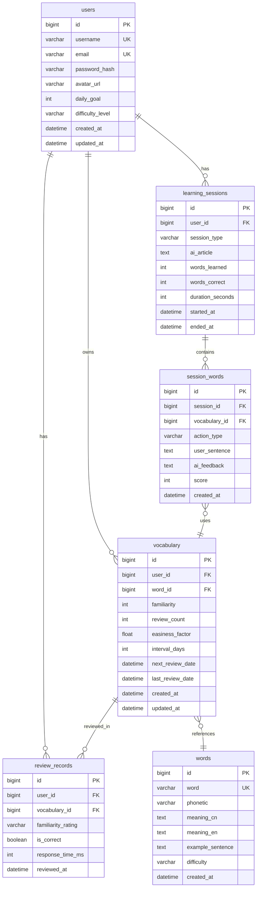

# LingoFlow 系统设计文档

## 1. 数�模�设计 (Data Model)

### 1.1 ER 关系图



### 1.2 数�表详细设计

#### users 用户表

| 字段 | 类� | 约� | 说� |
|------|------|------|------|
| id | BIGINT | PK, AUTO_INCREMENT | 用户ID |
| username | VARCHAR(50) | UNIQUE, NOT NULL | 用户� |
| email | VARCHAR(100) | UNIQUE | 邮箱 |
| password_hash | VARCHAR(255) | NOT NULL | bcrypt 加密密� |
| avatar_url | VARCHAR(255) | NULL | 头�URL |
| daily_goal | INT | DEFAULT 20 | �日目标�数 |
| difficulty_level | VARCHAR(20) | DEFAULT 'medium' | 难度�好 (easy/medium/hard) |
| created_at | DATETIME | DEFAULT NOW() | 创建时间 |
| updated_at | DATETIME | ON UPDATE NOW() | 更新时间 |

**索引**: `idx_username`, `idx_email`

#### words �库表

| 字段 | 类� | 约� | 说� |
|------|------|------|------|
| id | BIGINT | PK, AUTO_INCREMENT | ��ID |
| word | VARCHAR(100) | UNIQUE, NOT NULL | �� |
| phonetic | VARCHAR(100) | NULL | 音标 |
| meaning_cn | TEXT | NOT NULL | 中文释义 |
| meaning_en | TEXT | NULL | 英文释义 |
| example_sentence | TEXT | NULL | 例� |
| difficulty | VARCHAR(20) | DEFAULT 'medium' | 难度等级 |
| created_at | DATETIME | DEFAULT NOW() | 创建时间 |

**索引**: `idx_word`, `idx_difficulty`

#### vocabulary 用户生�本

| 字段 | 类� | 约� | 说� |
|------|------|------|------|
| id | BIGINT | PK, AUTO_INCREMENT | 记录ID |
| user_id | BIGINT | FK -> users.id | 用户ID |
| word_id | BIGINT | FK -> words.id | ��ID |
| familiarity | INT | DEFAULT 0 | 熟悉度 (0-100) |
| review_count | INT | DEFAULT 0 | �习次数 |
| easiness_factor | FLOAT | DEFAULT 2.5 | SM-2 简易因� |
| interval_days | INT | DEFAULT 1 | �习间隔天数 |
| next_review_date | DATETIME | NULL | 下次�习日期 |
| last_review_date | DATETIME | NULL | 上次�习日期 |
| created_at | DATETIME | DEFAULT NOW() | 添加时间 |
| updated_at | DATETIME | ON UPDATE NOW() | 更新时间 |

**索引**: `idx_user_word` (user_id, word_id), `idx_next_review` (user_id, next_review_date)

#### learning_sessions 学习会�表

| 字段 | 类� | 约� | 说� |
|------|------|------|------|
| id | BIGINT | PK, AUTO_INCREMENT | 会�ID |
| user_id | BIGINT | FK -> users.id | 用户ID |
| session_type | VARCHAR(20) | NOT NULL | 类� (learn/review) |
| ai_article | TEXT | NULL | AI生�的文章 |
| words_learned | INT | DEFAULT 0 | 学习��数 |
| words_correct | INT | DEFAULT 0 | 正确��数 |
| duration_seconds | INT | DEFAULT 0 | �续时间(秒) |
| started_at | DATETIME | DEFAULT NOW() | 开始时间 |
| ended_at | DATETIME | NULL | 结�时间 |

**索引**: `idx_user_session` (user_id, started_at)

#### session_words 会���记录表

| 字段 | 类� | 约� | 说� |
|------|------|------|------|
| id | BIGINT | PK, AUTO_INCREMENT | 记录ID |
| session_id | BIGINT | FK -> learning_sessions.id | 会�ID |
| vocabulary_id | BIGINT | FK -> vocabulary.id | 生�ID |
| action_type | VARCHAR(20) | NOT NULL | �作类� (skip/add/practice) |
| user_sentence | TEXT | NULL | 用户造� |
| ai_feedback | TEXT | NULL | AI�馈 |
| score | INT | NULL | 评分 (0-100) |
| created_at | DATETIME | DEFAULT NOW() | 创建时间 |

**索引**: `idx_session` (session_id)

#### review_records �习记录表

| 字段 | 类� | 约� | 说� |
|------|------|------|------|
| id | BIGINT | PK, AUTO_INCREMENT | 记录ID |
| user_id | BIGINT | FK -> users.id | 用户ID |
| vocabulary_id | BIGINT | FK -> vocabulary.id | 生�ID |
| rating | VARCHAR(20) | NOT NULL | 自评 (known/unknown) |
| test_passed | BOOLEAN | NULL | 测试是�通过 |
| response_time_ms | INT | NULL | �应时间(毫秒) |
| created_at | DATETIME | DEFAULT NOW() | 创建时间 |

**索引**: `idx_user_review` (user_id, created_at)

### 1.3 数��久化策略

| 策略 | 说� |
|------|------|
| 主数�库 | MySQL 8.0，存储所有�久化数� |
| 缓存层 | Redis，缓存用户会��热门����日统计 |
| Token 存储 | Redis，JWT Refresh Token 黑�� |

---

## 2. ��设计 (API Contracts)

### 一�Authentication Module (认�模�)

---

#### 1. Register (用户注册)

**Description**: 用户注册��，用户点击注册按钮�起请求  
**关�用户地图**: [UM-01: 注册�]

**Endpoint**: `POST /api/auth/register`

**Header**: `null`

**Request**:
```json
{
  "username": "testuser",
  "email": "test@example.com",
  "password": "password123",
  "confirmPassword": "password123"
}
```

**Response**:
```json
{
  "code": 200,
  "msg": "success",
  "data": {
    "userId": 1,
    "username": "testuser"
  }
}
```

**Error Scenarios**:
- `400 Bad Request`: Code 1001 (用户�已存在)
- `400 Bad Request`: Code 1002 (邮箱已注册)
- `400 Bad Request`: Code 1003 (两次密��一致)
- `400 Bad Request`: Code 1004 (密�强度�足)

**Database Logic**:
- Table: `users`
- Action: `INSERT`
- Notes: 密�存储�必须进行 bcrypt 加密，�止�文存储

---

#### 2. Login (用户登录)

**Description**: 用户登录��，返� JWT Token  
**关�用户地图**: [UM-02: 登录�]

**Endpoint**: `POST /api/auth/login`

**Header**: `null`

**Request**:
```json
{
  "username": "testuser",
  "password": "password123"
}
```

**Response**:
```json
{
  "code": 200,
  "msg": "success",
  "data": {
    "accessToken": "eyJhbGciOiJIUzI1NiIsInR5cCI6IkpXVCJ9...",
    "refreshToken": "eyJhbGciOiJIUzI1NiIsInR5cCI6IkpXVCJ9...",
    "expiresIn": 3600,
    "user": {
      "id": 1,
      "username": "testuser",
      "avatar": null
    }
  }
}
```

**Error Scenarios**:
- `401 Unauthorized`: Code 1010 (用户�或密�错误)
- `403 Forbidden`: Code 1011 (账�已被�用)

**Database Logic**:
- Table: `users`
- Action: `SELECT` (验�用户�密�)

---

#### 3. Refresh Token (刷新令牌)

**Description**: 使用 Refresh Token ��新的 Access Token

**Endpoint**: `POST /api/auth/refresh`

**Header**: `Authorization: Bearer {refreshToken}`

**Request**: `null`

**Response**:
```json
{
  "code": 200,
  "msg": "success",
  "data": {
    "accessToken": "eyJhbGciOiJIUzI1NiIsInR5cCI6IkpXVCJ9...",
    "expiresIn": 3600
  }
}
```

**Error Scenarios**:
- `401 Unauthorized`: Code 1020 (Refresh Token 无效或已过期)

---

#### 4. Logout (登出)

**Description**: 用户登出，将 Refresh Token 加入黑��

**Endpoint**: `POST /api/auth/logout`

**Header**: `Authorization: Bearer {accessToken}`

**Request**: `null`

**Response**:
```json
{
  "code": 200,
  "msg": "success",
  "data": null
}
```

**Database Logic**:
- Redis: 将 Refresh Token 加入黑��

---

### 二�Learning Module (学习模�)

---

#### 5. Get Words For Learning (��学习��)

**Description**: ��待学习的��列表  
**关�用户地图**: [UM-03: 学习新��]

**Endpoint**: `GET /api/learning/words`

**Header**: `Authorization: Bearer {accessToken}`

**Query Params**:
- `count`: ��数� (默认 10)
- `difficulty`: 难度筛选 (�选)

**Response**:
```json
{
  "code": 200,
  "msg": "success",
  "data": {
    "words": [
      {
        "id": 1,
        "word": "ephemeral",
        "phonetic": "/ɪˈfemərəl/",
        "meaningCn": "adj. 短暂的，转���的",
        "meaningEn": "lasting for a very short time",
        "exampleSentence": "Fame is often ephemeral."
      }
    ],
    "total": 10
  }
}
```

**Database Logic**:
- Table: `words`
- Action: `SELECT` (�除用户已加入生�本的��)

---

#### 6. Add Word To Vocabulary (加入生�本)

**Description**: 将��加入用户生�本  
**关�用户地图**: [UM-03: 学习新��]

**Endpoint**: `POST /api/vocabulary`

**Header**: `Authorization: Bearer {accessToken}`

**Request**:
```json
{
  "wordId": 1
}
```

**Response**:
```json
{
  "code": 200,
  "msg": "success",
  "data": {
    "vocabularyId": 123
  }
}
```

**Error Scenarios**:
- `400 Bad Request`: Code 2001 (��已在生�本中)
- `404 Not Found`: Code 2002 (���存在)

**Database Logic**:
- Table: `vocabulary`
- Action: `INSERT`

---

#### 7. Generate AI Article (AI 生�文章)

**Description**: 调用 AI 生�包�指定生�的文章  
**关�用户地图**: [UM-04: AI 文章学习�]

**Endpoint**: `POST /api/learning/article`

**Header**: `Authorization: Bearer {accessToken}`

**Request**:
```json
{
  "vocabularyIds": [1, 2, 3, 4, 5],
  "difficulty": "medium",
  "length": "short"
}
```

**Response**:
```json
{
  "code": 200,
  "msg": "success",
  "data": {
    "sessionId": 456,
    "article": {
      "title": "The Art of Living in the Moment",
      "content": "In our fast-paced modern world, we often forget that life is fundamentally ephemeral...",
      "highlightWords": [
        {"word": "ephemeral", "positions": [12, 45]}
      ]
    }
  }
}
```

**Error Scenarios**:
- `400 Bad Request`: Code 2010 (生�数��足)
- `503 Service Unavailable`: Code 2011 (AI �务暂时��用)

**Database Logic**:
- Table: `learning_sessions`
- Action: `INSERT` (创建新会�)
- External: 调用硅基�动 API

---

#### 8. Submit Sentence (�交造�)

**Description**: 用户�交造�，AI 进行批改  
**关�用户地图**: [UM-05: 造�练习�]

**Endpoint**: `POST /api/learning/sentence`

**Header**: `Authorization: Bearer {accessToken}`

**Request**:
```json
{
  "sessionId": 456,
  "vocabularyId": 1,
  "sentence": "The beauty of cherry blossoms is ephemeral."
}
```

**Response**:
```json
{
  "code": 200,
  "msg": "success",
  "data": {
    "score": 95,
    "isCorrect": true,
    "feedback": {
      "grammar": "��结�完整",
      "usage": "��使用正确，准确表达了'短暂'的�义",
      "suggestion": "�以�试使用更��的��结��丰富表达"
    }
  }
}
```

**Error Scenarios**:
- `400 Bad Request`: Code 2020 (��为空)
- `400 Bad Request`: Code 2021 (未包�目标��)

**Database Logic**:
- Table: `session_words`
- Action: `INSERT`
- External: 调用硅基�动 API 进行批改

---

### 三�Review Module (�习模�)

---

#### 9. Get Review Queue (���习队列)

**Description**: ��今日待�习的��队列  
**关�用户地图**: [UM-06: �习测试�]

**Endpoint**: `GET /api/review/queue`

**Header**: `Authorization: Bearer {accessToken}`

**Response**:
```json
{
  "code": 200,
  "msg": "success",
  "data": {
    "words": [
      {
        "vocabularyId": 123,
        "word": "ubiquitous",
        "phonetic": "/ju�ˈbɪkwɪtəs/",
        "meaningCn": "adj. 无处�在的",
        "familiarity": 45,
        "reviewCount": 3
      }
    ],
    "total": 8
  }
}
```

**Database Logic**:
- Table: `vocabulary`
- Action: `SELECT WHERE next_review_date <= NOW()`

---

#### 10. Submit Familiarity Rating (�交熟悉度自评)

**Description**: 用户�交对��的熟悉度自评  
**关�用户地图**: [UM-06: �习测试�]

**Endpoint**: `POST /api/review/rating`

**Header**: `Authorization: Bearer {accessToken}`

**Request**:
```json
{
  "vocabularyId": 123,
  "rating": "known"
}
```

**Response**:
```json
{
  "code": 200,
  "msg": "success",
  "data": {
    "needTest": true,
    "testQuestion": {
      "type": "choice",
      "question": "请选择 'ubiquitous' 的正确释义",
      "options": [
        {"id": "A", "text": "独特的，独一无二的"},
        {"id": "B", "text": "无处�在的，普�存在的"},
        {"id": "C", "text": "模糊的，�清楚的"},
        {"id": "D", "text": "紧急的，迫切的"}
      ],
      "correctAnswer": "B"
    }
  }
}
```

**Database Logic**:
- Table: `review_records`
- Action: `INSERT`

---

#### 11. Submit Test Answer (�交测试答案)

**Description**: �交�习测试的答案  
**关�用户地图**: [UM-06: �习测试�]

**Endpoint**: `POST /api/review/answer`

**Header**: `Authorization: Bearer {accessToken}`

**Request**:
```json
{
  "vocabularyId": 123,
  "answer": "无处�在的，普�存在的",
  "isFromErrorQueue": false,
  "responseTimeMs": 2500
}
```

**Response**:
```json
{
  "code": 200,
  "msg": "success",
  "data": {
    "isCorrect": true,
    "correctAnswer": "B",
    "nextReviewDate": "2026-01-20",
    "newFamiliarity": 60
  }
}
```

**Database Logic**:
- Table: `vocabulary`
- Action: `UPDATE` (更新 SM-2 �数)
- Table: `review_records`
- Action: `UPDATE`

---

### 四�Vocabulary Module (生�本模�)

---

#### 12. Get Vocabulary List (��生�列表)

**Description**: ��用户生�本列表

**Endpoint**: `GET /api/vocabulary`

**Header**: `Authorization: Bearer {accessToken}`

**Query Params**:
- `page`: 页� (默认 1)
- `size`: �页数� (默认 20)
- `status`: 状�筛选 (new/learning/mastered)
- `search`: �索关键�

**Response**:
```json
{
  "code": 200,
  "msg": "success",
  "data": {
    "words": [
      {
        "vocabularyId": 123,
        "word": "ephemeral",
        "meaningCn": "adj. 短暂的",
        "familiarity": 80,
        "status": "mastered",
        "nextReviewDate": "2026-01-25",
        "addedAt": "2026-01-10"
      }
    ],
    "pagination": {
      "page": 1,
      "size": 20,
      "total": 56
    }
  }
}
```

**Database Logic**:
- Table: `vocabulary` JOIN `words`
- Action: `SELECT`

---

#### 13. Delete Vocabulary (删除生�)

**Description**: �生�本中删除��

**Endpoint**: `DELETE /api/vocabulary/{vocabularyId}`

**Header**: `Authorization: Bearer {accessToken}`

**Response**:
```json
{
  "code": 200,
  "msg": "success",
  "data": null
}
```

**Error Scenarios**:
- `404 Not Found`: Code 3001 (生��存在)
- `403 Forbidden`: Code 3002 (无��作)

**Database Logic**:
- Table: `vocabulary`
- Action: `DELETE`

---

### 五�Statistics Module (统计模�)

---

#### 14. Get Dashboard Stats (��仪表盘统计)

**Description**: ��首页统计数�  
**关�用户地图**: [UM-07: 查看统计�]

**Endpoint**: `GET /api/stats/overview`

**Header**: `Authorization: Bearer {accessToken}`

**Response**:
```json
{
  "code": 200,
  "msg": "success",
  "data": {
    "todayLearned": 12,
    "todayReviewed": 8,
    "pendingReview": 15,
    "totalWords": 256
  }
}
```

**Database Logic**:
- Table: `vocabulary`, `learning_sessions`, `review_records`
- Action: `SELECT` (��查询)

---

#### 15. Get Weekly Stats (��周学习统计)

**Description**: ��本周�日学习数�

**Endpoint**: `GET /api/stats/weekly`

**Header**: `Authorization: Bearer {accessToken}`

**Response**:
```json
{
  "code": 200,
  "msg": "success",
  "data": {
    "weekData": [
      {"day": "Mon", "learned": 15, "reviewed": 10},
      {"day": "Tue", "learned": 20, "reviewed": 12},
      {"day": "Wed", "learned": 12, "reviewed": 8},
      {"day": "Thu", "learned": 25, "reviewed": 15},
      {"day": "Fri", "learned": 18, "reviewed": 11},
      {"day": "Sat", "learned": 10, "reviewed": 5},
      {"day": "Sun", "learned": 16, "reviewed": 9}
    ]
  }
}
```

**Database Logic**:
- Table: `learning_sessions`, `review_records`
- Action: `SELECT GROUP BY DATE`

---

## 3. 状��规范

| HTTP Status | 业务 Code 范围 | 说� |
|-------------|----------------|------|
| 200 | 0 | �功 |
| 400 | 1000-1999 | 认�相关错误 |
| 400 | 2000-2999 | 学习/�习相关错误 |
| 400 | 3000-3999 | 生�本相关错误 |
| 401 | - | 未认� |
| 403 | - | 无�� |
| 404 | - | 资��存在 |
| 500 | 9000-9999 | �务端错误 |

---

## 4. 安全规范

| 规范 | 说� |
|------|------|
| 密�加密 | bcrypt (cost=12) |
| Token 类� | JWT (HS256) |
| Access Token 有效期 | 1 �时 |
| Refresh Token 有效期 | 7 天 |
| �感信� | �止日志记录密��Token |
| CORS | �置�许的域� |
| Rate Limit | 登录���� 10次/分钟 |
---

## 5. �端路由�� (Frontend Routing)

### 5.1 路由结�

应用采用 **嵌套路由** ��,所有主�功能页�共享统一�MainLayout 布局,�供�久化侧边�导航�

```
/
├── /login                  # 登录�(独立布局)
├── /register               # 注册�(独立布局)
└── / (MainLayout)          # 主布局容器
    ├── /                   # 首页 (HomeView)
    ├── /learn              # 学习�(LearnView)
    ├── /vocabulary         # 生��(VocabularyView)
    └── /review             # �习�(ReviewView)
```

### 5.2 路由守�

- **认�守�**: 所有主�功能页�(`requiresAuth: true`) 需�JWT Token
- **�定�逻辑**:
  - 未登录访问��护页� ��定�到 `/login`
  - 已登录访问登�注册���定�到 `/` (首页)

### 5.3 MainLayout 组件特�

| 特�| 说� |
|------|------|
| **�久化导�* | 左侧边�在页�切�时���� |
| **路由高亮** | 当�活动路由自动高亮显示 |
| **页�过渡动画** | fade-slide 过渡效� (400ms cubic-bezier) |
| **用户信�展示** | 侧边�底部显示当�登录用�|
| **登出功能** | 统一的登出按�清除 Token 并�定� |

### 5.4 组件层级结�

```
App.vue
├── LoginView.vue (独立)
├── RegisterView.vue (独立)
└── MainLayout.vue (布局容器)
    ├── Sidebar (导航��)
    ├── UserProfile (用户信�)
    └── <router-view> (动�内容区)
        ├── HomeView.vue
        �  └── WeeklyChart.vue (图表组件)
        ├── LearnView.vue
        ├── VocabularyView.vue
        └── ReviewView.vue
```
