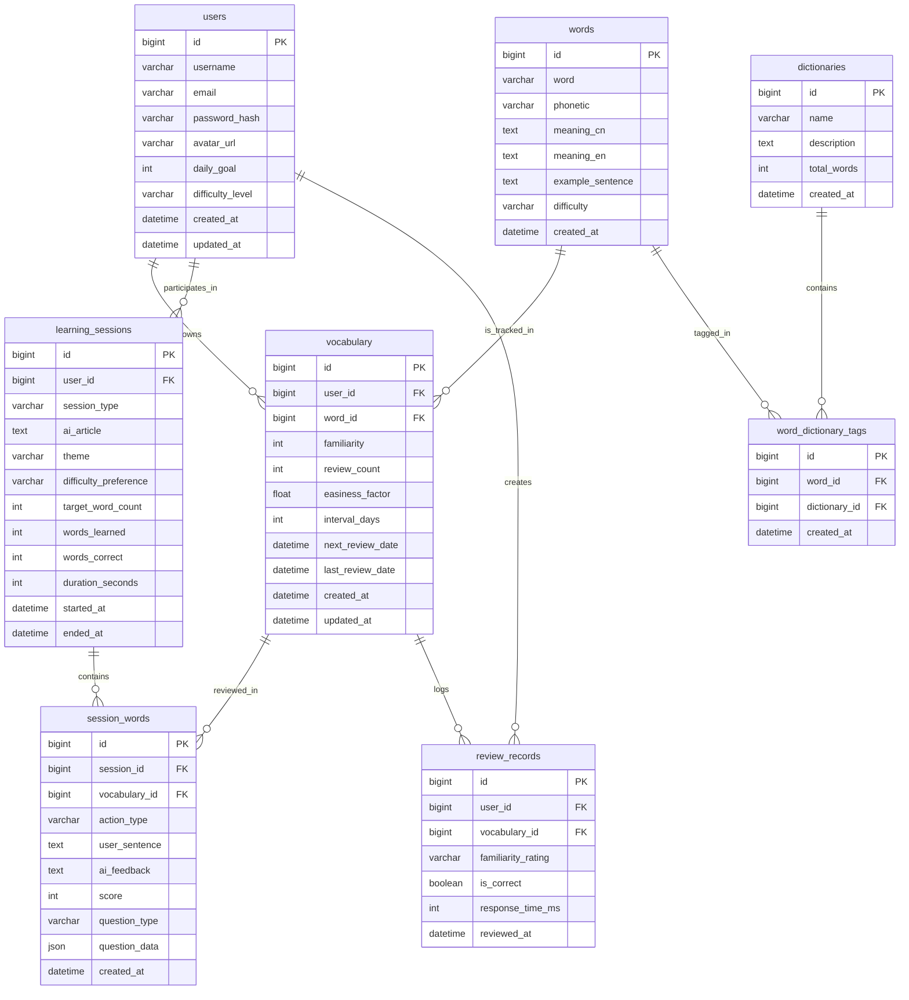

# LingoFlow 系统设计文档

## 1. 数据模型设计 (Data Model)

### 1.1 ER 关系图



### 1.2 数据表详细设计

#### users 用户表
| 字段 | 类型 | 说明 |
|------|------|------|
| id | BIGINT | PK |
| username | VARCHAR(50) | 用户名 |
| email | VARCHAR(100) | 邮箱 |
| password_hash | VARCHAR(255) | 密码哈希 |
| avatar_url | VARCHAR(255) | 头像URL |
| daily_goal | INT | 每日学习目标 |
| difficulty_level | VARCHAR(20) | 难度偏好 |
| created_at | DATETIME | 创建时间 |
| updated_at | DATETIME | 更新时间 |

#### words 词库表
| 字段 | 类型 | 说明 |
|------|------|------|
| id | BIGINT | PK |
| word | VARCHAR(100) | 单词 |
| meaning_cn | TEXT | 中文释义 |
| difficulty | VARCHAR(20) | 难度 |

#### vocabulary 用户生词本
| 字段 | 类型 | 说明 |
|------|------|------|
| id | BIGINT | PK |
| user_id | BIGINT | FK -> users.id |
| word_id | BIGINT | FK -> words.id |
| familiarity | INT | 熟悉度 (0-5) |
| next_review_date | DATETIME | 下次复习时间 |

#### learning_sessions 学习会话表
| 字段 | 类型 | 说明 |
|------|------|------|
| id | BIGINT | PK |
| user_id | BIGINT | FK -> users.id |
| session_type | VARCHAR | 'article' |
| ai_article | TEXT | AI生成的文章 |
| theme | VARCHAR(50) | 学习主题 |
| difficulty_preference | VARCHAR(20) | 难度偏好 |
| target_word_count | INT | 目标词汇数量 |

#### session_words 会话单词记录表
| 字段 | 类型 | 说明 |
|------|------|------|
| id | BIGINT | PK |
| session_id | BIGINT | FK -> learning_sessions.id |
| vocabulary_id | BIGINT | FK -> vocabulary.id |
| action_type | VARCHAR | 'sentence', 'show', 'quiz' |
| question_type | VARCHAR(30) | 'sentence_making', 'word_comprehension' |
| question_data | JSON | 题目数据 |
| user_sentence | TEXT | 用户造句 |
| ai_feedback | TEXT | AI反馈 |
| score | INT | 评分 |

#### dictionaries 词典表 (Phase 6)
| 字段 | 类型 | 说明 |
|------|------|------|
| id | BIGINT | PK |
| name | VARCHAR(50) | 词典名称 |
| description | TEXT | 描述 |
| total_words | INT | 总词数 |

### 1.3 Redis 缓存设计

#### Key: `learning:selection:{userId}`
- **Type**: String (JSON)
- **TTL**: 1 Hour
- **Value Structure**:
  ```json
  {
    "words": [ ... ], // List of Word objects
    "currentIndex": 0,
    "selectedWords": [ ... ], // List of selected Word objects
    "timestamp": 1234567890
  }
  ```
- **Purpose**: Cache the current batch of new words being learned.

#### Key: `review:queue:{userId}:{date}`
- **Type**: String (JSON)
- **TTL**: 24 Hours (Expire at midnight)
- **Value Structure**:
  ```json
  {
    "words": [ ... ], // List of ReviewWord objects
    "total": 10
  }
  ```
- **Purpose**: Cache daily review queue to reduce complex SQL queries. Invalidated on rating submission.

## 2. 接口设计 (API Contracts)

### Authentication
- POST `/api/auth/register`
- POST `/api/auth/login`

### Vocabulary
- GET `/api/vocabulary`
- POST `/api/vocabulary/batch` (Batch Add/Get)
  - Request: `{ wordIds: [1, 2, 3] }`
  - Response: List of Vocabulary objects

### Learning
- POST `/api/learning/start`
- GET `/api/learning/words` (Enhanced with caching)
- POST `/api/learning/progress`
  - Request: `{ currentIndex: 2, selectedWords: [...] }`
- POST `/api/learning/article/generate`
- POST `/api/learning/sentence`
  - Logic: Only retains the highest scoring sentence per word.

### Review
- GET `/api/review/due`
- POST `/api/review/submit`

### Dictionary
- GET `/api/dictionaries`
- GET `/api/dictionaries/{id}/words`

### User Profile
- GET `/api/user/profile`
  - Response: `{ id, username, email, avatarUrl, dailyGoal, difficultyLevel, createdAt, totalWordsLearned, streakDays }`
- PUT `/api/user/profile`
  - Request: `{ email?, avatarUrl?, dailyGoal?, difficultyLevel? }`
  - Response: Updated UserProfile
- PUT `/api/user/password`
  - Request: `{ currentPassword, newPassword, confirmPassword }`

### Statistics
- GET `/api/stats/overview`
  - Response: `{ todayLearned, pendingReview, totalWords, streakDays, dailyGoal }`
- GET `/api/stats/weekly`
  - Response: `[{ date, count, reviewCount }]` (过去7天数据)

## 3. 核心业务逻辑

### 3.1 学习流程
1. 选择词书/词典
2. 每日推荐或自主选择单词
3. 调用 `/api/vocabulary/batch` 批量添加到生词本
4. 生成 AI 文章 (包含了选定单词)
5. 阅读文章 -> 完成阅读理解 (Quiz) -> 针对生词造句
6. 造句保留最高分逻辑: 新造句分数 >= 旧分数时替换，否则保留旧记录。

### 3.2 复习流程 (SRS)
- 基于 SuperMemo 2 算法
- 根据用户评分 (0-5) 计算下次复习间隔
