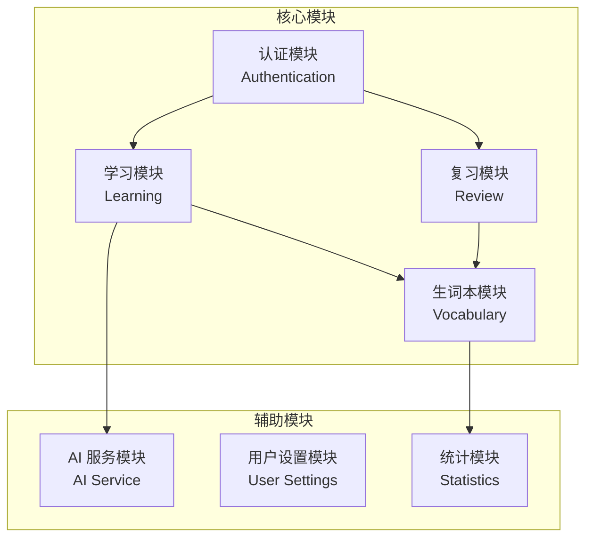
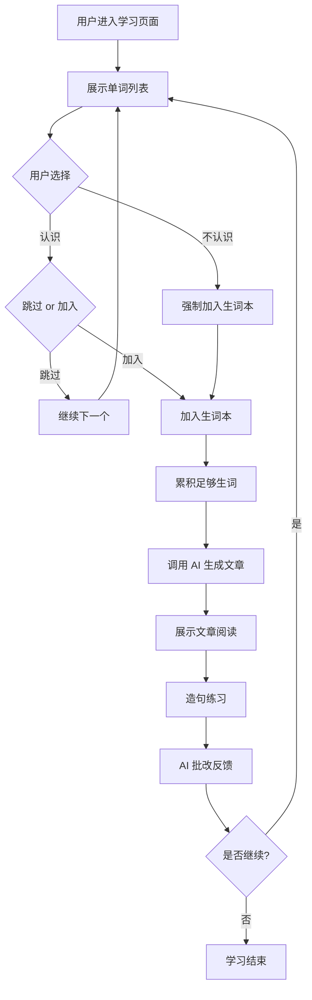
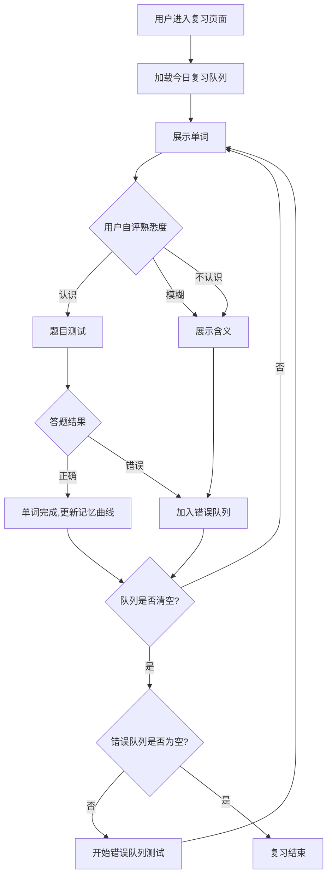

# LingoFlow 需求规格说明书

## 1. 项目概览

- **项目名称**: LingoFlow
- **核心定位**: 通过 AI 生成文章，解决用户背单词容易忘的痛点
- **设计理念**: AI 驱动、输出反馈学习、沉浸式记忆

---

## 2. 模块化拆分 (Module Breakdown)



### 2.1 认证模块 (Authentication)
| 功能 | 描述 |
|------|------|
| 用户注册 | 邮箱/用户名注册，密码加密存储 |
| 用户登录 | JWT Token 认证 |
| Token 刷新 | 无感刷新机制 |
| 登出 | 清除本地 Token |

### 2.2 学习模块 (Learning)
| 功能 | 描述 |
|------|------|
| 单词测试 | 给出单词以及四个选项,用户选对则可以选择跳过,选错了则只能加入到本次学习的生词本中 |
| 灵活选词 | 用户浏览完所有可选单词后，即使选中少于5个也可进入学习阶段（最少1个） |
| AI 文章生成 | 调用 AI 生成包含生词本的文章 |
| 阅读理解 | 展示文章，用户阅读学习 |
| 造句练习 | 用户使用生词造句 |
| AI 批改 | AI 批改造句并给出反馈 |

### 2.3 复习模块 (Review)
| 功能 | 描述 |
|------|------|
| 复习队列 | 基于遗忘曲线生成复习任务 |
| 熟悉度测试 | 用户自评：认识/模糊/不认识 |
| 题目测试 | 选择题验证记忆 |
| 错误队列 | 错误单词循环测试直到全部正确 |

### 2.4 生词本模块 (Vocabulary)
| 功能 | 描述 |
|------|------|
| 生词列表 | 查看所有生词及状态 |
| 单词详情 | 查看释义、例句、记忆曲线 |
| 手动添加 | 用户主动添加单词 |
| 删除单词 | 移除已掌握的单词 |

### 2.5 AI 服务模块 (AI Service)
| 功能 | 描述 |
|------|------|
| 文章生成 | 调用硅基流动 API 生成文章 |
| 造句批改 | AI 评判造句语法和语义 |
| 难度调节 | 根据用户水平调整生成内容 |

### 2.6 用户设置模块 (User Settings)
| 功能 | 描述 |
|------|------|
| 个人信息 | 修改用户名、头像 |
| 学习偏好 | 设置每日目标、难度偏好 |
| 通知设置 | 复习提醒开关 |

### 2.7 统计模块 (Statistics)
| 功能 | 描述 |
|------|------|
| 学习数据 | 今日/本周/累计学习单词数 |
| 复习数据 | 复习次数、正确率 |
| 进度图表 | 可视化学习曲线 |

---

## 3. 核心逻辑闭环 (Logic Closed-loop)

### 3.1 学习黄金路径



**关键节点**:
1. **单词筛选** - 用户通过判断识别生词
2. **AI 文章生成** - 将生词融入语境
3. **造句练习** - 主动输出强化记忆
4. **AI 批改** - 即时反馈纠正

### 3.2 复习黄金路径



**关键节点**:
1. **熟悉度自评** - 快速分流
2. **题目验证** - 客观测试记忆
3. **错误循环** - 确保掌握
4. **记忆曲线更新** - SM-2 算法调度

---

## 4. 用户故事地图 (User Story Map)

### 4.1 用户角色

| 角色 | 描述 | 核心诉求 |
|------|------|----------|
| 新用户 | 首次使用应用 | 快速上手，了解功能 |
| 学习者 | 日常使用者 | 高效记忆单词 |
| 复习者 | 有积累的用户 | 巩固已学单词 |

### 4.2 用户故事

#### UM-01: 注册流
```
作为 新用户
我希望 能够快速注册账号
以便 开始使用学习功能

验收标准:
- 支持用户名/邮箱注册
- 密码强度提示
- 注册成功自动登录
```

#### UM-02: 登录流
```
作为 用户
我希望 能够安全登录
以便 访问我的学习数据

验收标准:
- 支持用户名/邮箱登录
- 记住登录状态 (JWT)
- 登录失败友好提示
```

#### UM-03: 学习新词流
```
作为 学习者
我希望 能筛选出不认识的单词
以便 有针对性地学习

验收标准:
- 逐个展示单词
- 可选择"认识"或"不认识"
- 不认识的词自动加入生词本
- 支持学习进度缓存（1小时内有效），刷新不丢失进度
```

#### UM-04: AI 文章学习流
```
作为 学习者
我希望 AI 生成包含我的生词的文章
以便 在语境中记忆单词

验收标准:
- 文章包含已选生词
- 文章难度适中
- 生词在文中高亮显示
```

#### UM-05: 造句练习流
```
作为 学习者
我希望 用生词造句并获得 AI 批改
以便 强化记忆和用法

验收标准:
- 展示当前生词
- 支持输入中英文句子
- AI 给出评分和修改建议
```

#### UM-06: 复习测试流
```
作为 复习者
我希望 能按遗忘曲线复习单词
以便 长期记忆单词

验收标准:
- 按 SM-2 算法调度复习
- 支持熟悉度自评
- 错误单词循环测试
```

#### UM-07: 查看统计流
```
作为 用户
我希望 查看我的学习统计
以便 了解学习进度

验收标准:
- 展示今日/本周/累计数据
- 可视化图表展示
- 显示连续学习天数
```

#### UM-08: 词典选择流
```
作为 学习者
我希望 能够选择不同的词典（四级、六级、雅思、托福等）
以便 根据我的学习目标进行针对性学习

验收标准:
- 进入网站时可选择词典
- 生词本按词典独立统计进度
- 每个单词显示所属词典标签
```

#### UM-09: 学习定制流
```
作为 学习者
我希望 在开始学习前能定制学习参数
以便 获得个性化的学习体验

验收标准:
- 可选择主题（科幻、文化等）
- 可选择难度（高、中、低）
- 可选择词汇数量（5个或10个）
- 定制参数影响AI生成的文章内容
```

#### UM-10: 增强阅读体验流
```
作为 学习者
我希望 在阅读AI文章时有丰富的交互功能
以便 更好地理解和学习单词

验收标准:
- 目标单词高亮显示
- 鼠标悬停单词显示气泡释义
- 点击朗读图标可朗读单词
- 支持整篇文章朗读
- 中文翻译可折叠查看
```

#### UM-11: 阅读理解测试流
```
作为 学习者
我希望 通过阅读理解题目加深对文章和单词的理解
以便 提升综合语言能力

验收标准:
- 包含2道词汇理解选择题
- 包含1道文章主旨题
- 选择后立即显示正确答案
- 题目下方显示中文解析
```

#### UM-12: 改进造句流
```
作为 学习者
我希望 造句题提供更多引导和灵活性
以便 降低造句难度，专注于单词应用

验收标准:
- 题目显示主题关键词
- 题目显示中文例句（可翻译或自由造句）
- 单词释义默认隐藏，点击"提示"按钮显示
```

---

## 5. 需求清单 (Requirement Checklist)

### 5.1 功能需求

| ID | 模块 | 需求描述 | 优先级 |
|----|------|----------|--------|
| FR-01 | 认证 | 用户注册 (用户名/密码) | P0 |
| FR-02 | 认证 | 用户登录 (JWT) | P0 |
| FR-03 | 认证 | Token 刷新 | P1 |
| FR-04 | 学习 | 单词展示与判断 | P0 |
| FR-05 | 学习 | 生词加入生词本 | P0 |
| FR-06 | 学习 | AI 生成文章 | P0 |
| FR-07 | 学习 | 文章阅读界面 | P0 |
| FR-08 | 学习 | 造句练习 | P0 |
| FR-09 | 学习 | AI 造句批改 | P0 |
| FR-10 | 复习 | 复习队列生成 | P0 |
| FR-11 | 复习 | 熟悉度自评 | P0 |
| FR-12 | 复习 | 选择题测试 | P0 |
| FR-13 | 复习 | 错误队列循环 | P0 |
| FR-14 | 生词本 | 生词列表查看 | P1 |
| FR-15 | 生词本 | 手动添加/删除单词 | P2 |
| FR-16 | 统计 | 学习数据统计 | P1 |
| FR-17 | 设置 | 用户偏好设置 | P2 |
| FR-18 | 词典 | 词典选择与切换 | P0 |
| FR-19 | 词典 | 词典进度独立统计 | P1 |
| FR-20 | 学习 | 学习定制（主题、难度、词汇数量） | P1 |
| FR-21 | 学习 | 文章单词高亮与气泡释义 | P1 |
| FR-22 | 学习 | 单词和文章朗读 | P2 |
| FR-23 | 学习 | 中文翻译折叠显示 | P2 |
| FR-24 | 学习 | 阅读理解选择题 | P1 |
| FR-25 | 学习 | 造句题主题和例句引导 | P1 |

### 5.2 非功能需求

| ID | 类型 | 需求描述 |
|----|------|----------|
| NFR-01 | 性能 | AI 响应时间 < 3s |
| NFR-02 | 安全 | 密码 bcrypt 加密 |
| NFR-03 | 安全 | JWT Token 认证 |
| NFR-04 | 可用性 | 响应式设计，支持移动端 |
| NFR-05 | 可扩展 | 模块化架构，便于迭代 |
| NFR-06 | 性能/体验 | 学习状态和复习队列需通过 Redis 缓存，支持断点续学 |

---

## 6. 技术规范

| 层级 | 技术选型 |
|------|----------|
| 前端 | Vue 3 + TypeScript + Element UI + Tailwind CSS |
| 后端 | Spring Boot |
| 数据库 | MySQL + Redis (缓存) |
| AI 服务 | 硅基流动 API |
| 认证 | JWT |
| 部署 | Docker (可选) |
